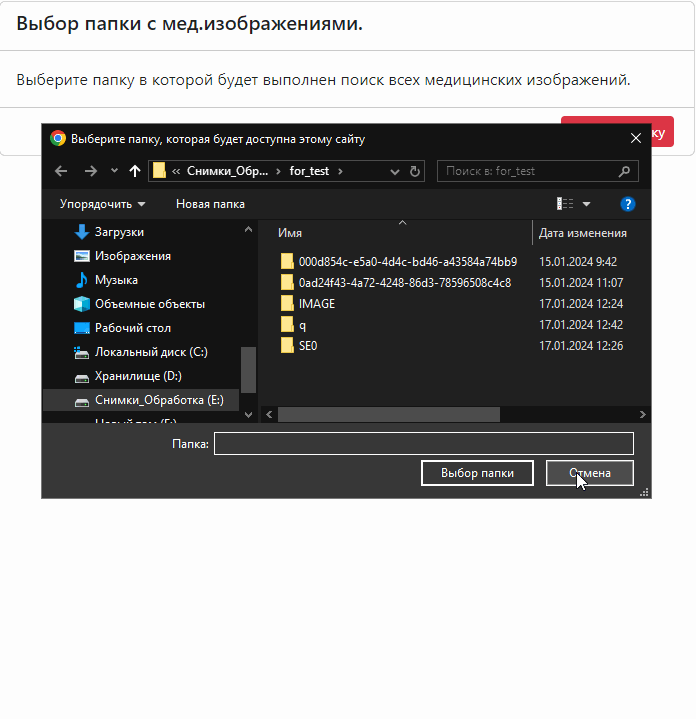

# jsPACSUploader

Небольшой пример приложения с пользовательским интерфейсом для 
рекурсивного поиска DICOM файлов на компьютере пользователя, 
их деперсонализации и передачи по HTTP.

## Начало работы

Скачать файл и инициировать на странице `WorkFlow`F

```JS
function acceptSendSuccessfulResult(val) {
    JSON.stringify(val)
}
let js_only = new WorkFlow({
    targetEl: document.getElementById("tabs-js-only"),
    modalityFilter: new Set(),
    limitOnNumberOfStudies: 1,
    urlForPostRequest: "https://pacs.domain.ru/instances",
    callbackSendSuccessfulResult: acceptSendSuccessfulResult
});
window.addEventListener("load", () => {
    js_only.view();
});
```
где:
- `@param {HTMLElement} targetEl` - HTML элемент внутрь которого будет выполнен рендер интерфейса.
- `@param {Set<string>} modalityFilter` - Множество ограничивающее модальности, которые разрешено отправлять на сервер. По умолчанию множество пустое - это соответствует отсутствию ограничений.
- `@param {Function} callbackSendSuccessfulResult` - Функция, которая вызывается после успешного выполнения процесса отправки файлов и возвращает объект с метаинформацией об исследовании.
- `@param {string} urlForPostRequest` - Url адрес для выполнения пост запроса.


## Пример

